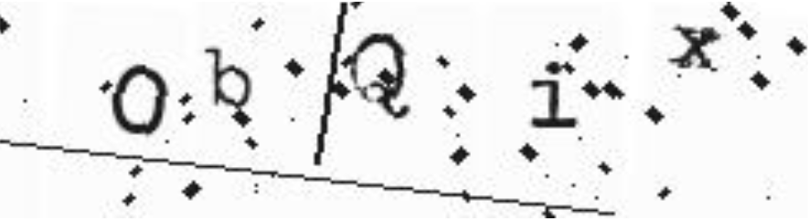
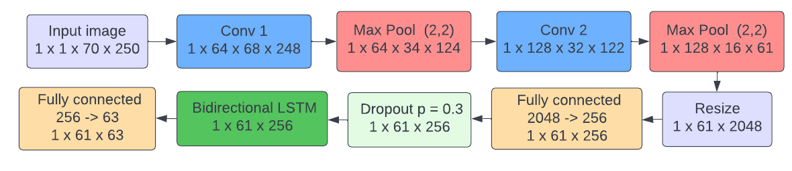
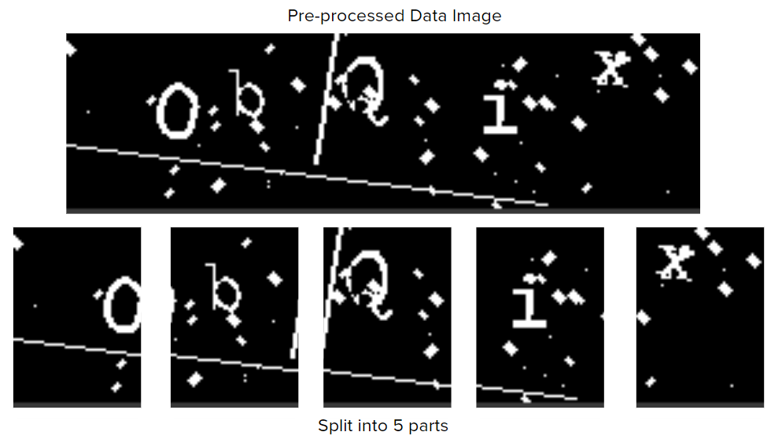
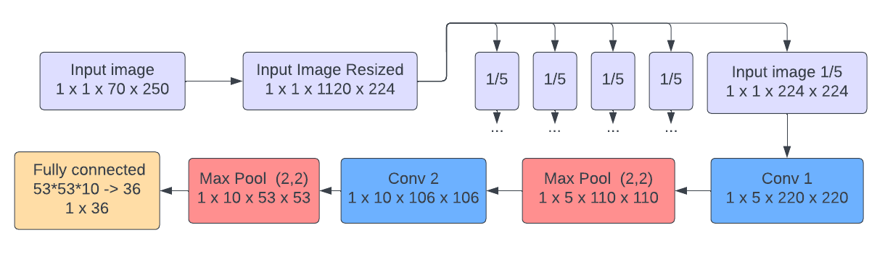
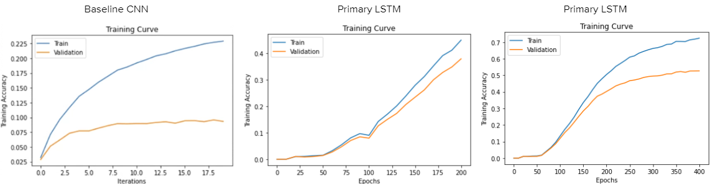
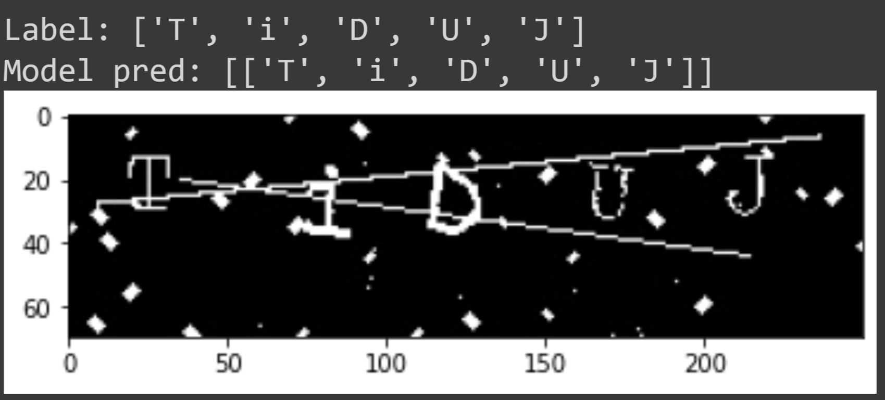
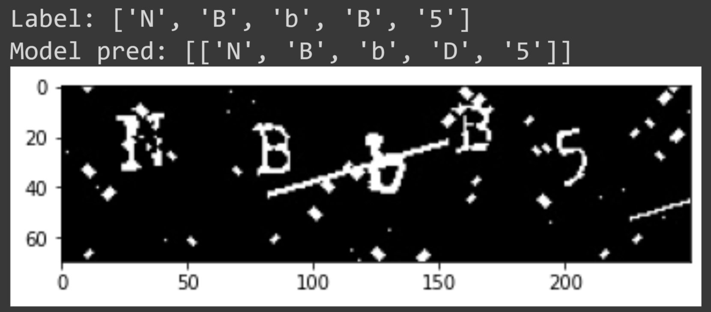
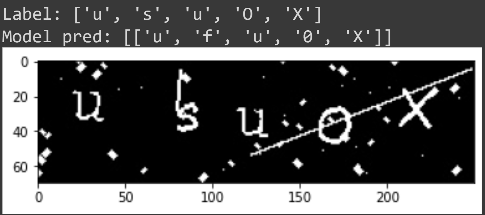

# Machine Learning CAPTCHA Solver
This project was completed in collaboration with [James Kokoska](https://github.com/jameskokoska), [Akshat Mengi](https://github.com/akshatm2) and Yanwen Mao

## Project Links
Google Colab: https://colab.research.google.com/drive/1tjJKs0kOQ36lVcVTC86cQi2NhmzvMDn-?usp=sharing

## Tools and Libraries
* PyTorch: an open-source machine learning framework that provides a seamless path from research to production
* NumPy: a library for scientific computing in Python, used for numerical operations on arrays and matrices
* Torchvision: a PyTorch library for computer vision tasks such as image classification, object detection, and segmentation
* Pillow: a library for handling and manipulating images in Python
* OpenCV: a library for computer vision tasks, used for image pre-processing in this project
* Matplotlib: a data visualization library in Python, used for creating plots and charts

Google Colab for running and testing our code, and Git for version control.

## Introduction
This project aims to explore the use of deep learning techniques, specifically a CNN-BiLSTM model, for solving text-based CAPTCHA tests. The goal is to understand the algorithms that could potentially crack CAPTCHA tests and use this knowledge to enhance CAPTCHA-generating systems and maintain a high level of network security. The CNN-BiLSTM model is chosen for its ability to recognize complicated alphanumeric characters and learn inherent features of text sequences in CAPTCHAs, allowing for accurate predictions on previously unseen CAPTCHAs. The project is important in the context of network and information security, as traditional CAPTCHAs are increasingly facing challenges from advances in computer technology.

## Data Generation
This project uses a custom CAPTCHA generator written in Python to generate data for training and testing a machine learning model. The generator creates images with random alpha-numeric character combinations as labels, and applies random distortions and noise to the images to create a diverse and challenging dataset. The model is trained on a dataset of 20,000 images, and its performance is evaluated on a separate test set of never-before-seen CAPTCHA images with different distortion parameters. The accuracy of the model is calculated based on the number of correctly identified characters in their correct positions in the labels. The custom CAPTCHA generator allows for flexibility in adjusting the difficulty of the training environment and testing the model's generalization to different types of distortions.

  
   
  <em>A randomly generated CAPTCHA using our Python Script (ObQix.jpg)</em>

## Data Processing
This project uses OpenCV and Gaussian blur median filters to preprocess its data before passing it into a neural network. The data is first converted to a single gray-scale color channel and any noise is reduced using a median filter. The image is then inverted using a threshold to normalize pixel values. This preprocessing helps to make the training and identification tasks more efficient. A sample CAPTCHA image is shown at each step of the preprocessing process.

  
   
  <em>A CAPTCHA image being processed before passed into the neural network at each step. Outlined in red for clarity.</em>

## Architecture
This project uses a combination of a CNN and a bidirectional LSTM to solve CAPTCHA tests by detecting and identifying sequences of characters. The CNN is used to gather local information about the image and the LSTM is used to learn the sequencing of the characters. The model includes convolutional layers, max pool layers, a fully connected layer, a dropout layer, and a fully connected output layer with 63 classes. The output is then decoded, with the "unknown character" class being discarded. The architecture of the model is designed to preserve the local information of the image while learning the sequencing of the characters.

  
   
  <em>Primary LSTM Architecture</em>

## Baseline Model
This project uses a baseline CNN model to classify individual characters in a CAPTCHA image by splitting the image into fifths and passing each section into the CNN. The CNN has a simple architecture similar to that used in image classification tasks, and is designed to classify the input into 36 different classes of alphanumeric characters. The baseline model is used to identify individual characters in the CAPTCHA. The process of splitting the image into fifths and classifying each section occurs during the training and accuracy functions.

  
   
  <em>Baseline Architecture</em>

## Results
| Model        | Epochs | Learning Rate | Batch Size | Overfit? | Training Size | Test Size | Test Accuracy (per letter) |
|--------------|--------|---------------|------------|----------|---------------|-----------|----------------------------|
| Baseline CNN | 20     | 0.001         | 32         | Yes      | 15,000        | 2,500     | 9.28%                      |
| Primary LSTM | 200    | 0.0001        | 128        | No       | 15,000        | 2,500     | 37.54%                     |
| Primary LSTM | 400    | 0.0001        | 128        | Yes      | 15,000        | 2,500     | 52.6%                      |

  
   
  <em>Training Accuracy for All Architectures</em>

 

The results of this project have been tested on a dataset that the model has never seen before, and the model's hyperparameters have not been adjusted based on this dataset. In some cases, the model is able to correctly identify all characters in a CAPTCHA image, but it may confuse characters that are similar in appearance, such as "0" and "O" or "8" and "g". The model may also make false predictions when the distortions in the image alter the structure of a character, causing it to appear as a different character. These behaviors are similar to those of humans when reading CAPTCHA images. In some cases, the model may mischaracterize a character due to the distortions in the image.

  
   
  <em>Correct model prediction</em>

 

  
   
  <em>Model confused between B and D</em>

 

  
   
  <em>Image distortion making predictions difficult</em>

 

## Conclusion
CAPTCHA recognition is a challenging task, and the data used in this project consists of heavily distorted and randomly rotated characters. The goal of this project was to explore a deep learning approach to solve text-based CAPTCHA tests and to identify the vulnerabilities of this type of CAPTCHA. A CNN-BiLSTM model was used for this task, as it is capable of addressing the complicated challenges of alphanumeric character identification while maintaining a relatively low model complexity. The model was trained on a dataset of 20,000 images, and the final average accuracy was 52.6% on a never-before-seen dataset. Although there is still a gap between the accuracy of this model and state-of-the-art approaches, the model demonstrates the potential of combining CNN and BiLSTM for CAPTCHA recognition tasks. Potential next steps for this project include improving the data preprocessing techniques and tuning the hyperparameters of the model. However, it is important to note that this application could potentially be used for malicious purposes, such as spam and bots, which CAPTCHAs are designed to prevent.
